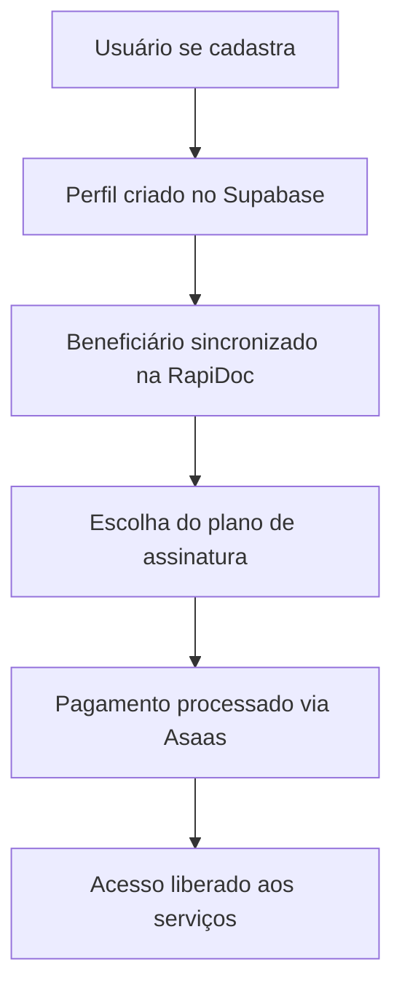
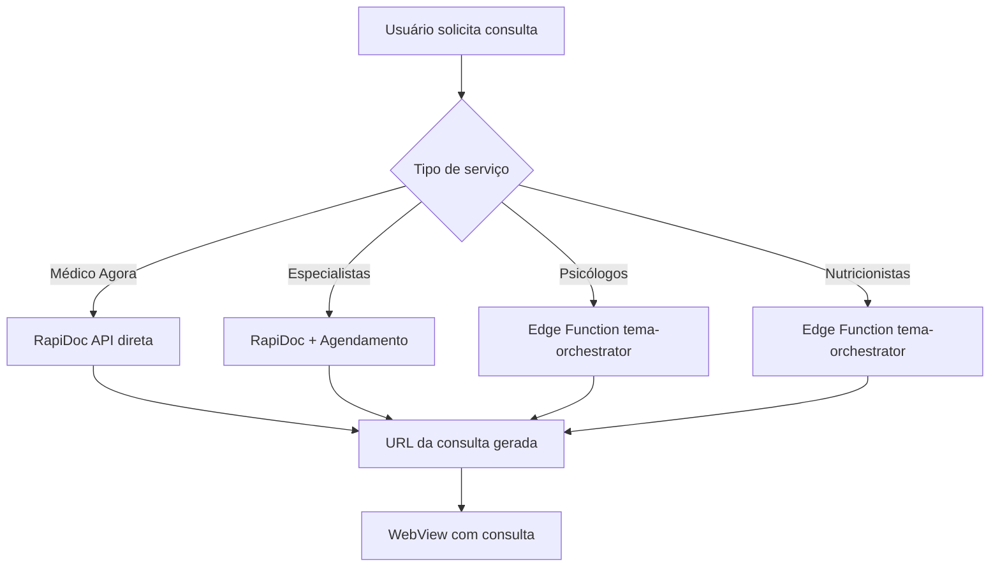
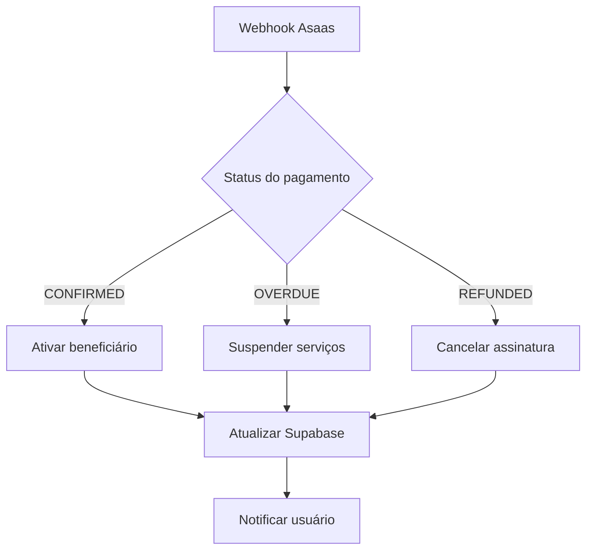

# Sistema Integrado Completo - AiLun Saúde

## 📋 **Visão Geral do Sistema**

O AiLun Saúde é um sistema completo de telemedicina que integra múltiplas plataformas para oferecer uma experiência unificada ao usuário:

### **🏗️ Arquitetura do Sistema**

```
┌─────────────────────────────────────────────────────────────┐
│                    FRONTEND (React Native)                  │
├─────────────────────────────────────────────────────────────┤
│              Serviço Integrado (Orquestrador)              │
├─────────────────────────────────────────────────────────────┤
│  RapiDoc API  │  Supabase Backend  │  Asaas Payments      │
│  (Consultas)  │  (Dados/Auth)      │  (Assinaturas)       │
└─────────────────────────────────────────────────────────────┘
```

### **🔗 Integrações Principais**

1. **RapiDoc** - API de Telemedicina
   - 12 Edge Functions ativas
   - Consultas em tempo real
   - Agendamentos com especialistas
   - Sistema de encaminhamentos

2. **Supabase** - Backend Completo
   - Autenticação segura
   - 20+ tabelas estruturadas
   - Real-time subscriptions
   - Storage para documentos

3. **Asaas** - Plataforma de Pagamentos
   - Assinaturas recorrentes (R$ 89,90/mês)
   - PIX e Cartão de crédito
   - Webhooks automáticos
   - Gestão de clientes

---

## 🏥 **Fluxos do Sistema**

### **1. Cadastro e Onboarding**



**Implementação:**
- `useIntegratedSystem.syncBeneficiary()`
- `integratedSystemService.createCompleteSubscription()`
- Edge Function `asaas-webhook` para confirmação

### **2. Solicitação de Consulta**



**Implementação:**
- `useIntegratedSystem.requestConsultation()`
- `integratedSystemService.requestIntegratedConsultation()`
- Edge Functions: `rapidoc`, `tema-orchestrator`, `orchestrator`

### **3. Gestão de Assinatura**



**Implementação:**
- Edge Function `asaas-webhook`
- `integratedSystemService.processAsaasWebhook()`
- Sistema de notificações automáticas

---

## 🗃️ **Estrutura do Banco de Dados**

### **Tabelas Principais**

#### **👤 Gestão de Usuários**
- `user_profiles` - Perfis completos dos usuários
- `beneficiaries` - Beneficiários ativos (sincronizados com RapiDoc)
- `subscription_plans` - Planos de assinatura ativos
- `plan_members` - Membros familiares dos planos

#### **🏥 Sistema de Consultas**
- `consultation_history` - Histórico completo de consultas
- `active_sessions` - Sessões ativas de atendimento
- `consultation_queue` - Fila de espera para consultas
- `consultation_logs` - Logs detalhados de atendimento
- `consultation_reminders` - Lembretes automáticos

#### **💰 Gestão de Pagamentos**
- `payment_logs` - Histórico de transações
- `subscription_plans` - Dados dos planos contratados
- Integração com Asaas via webhooks

#### **🔔 Sistema de Notificações**
- `system_notifications` - Notificações do sistema
- `user_preferences` - Preferências de notificação
- Real-time via Supabase subscriptions

#### **📊 Auditoria e Logs**
- `audit_logs` - Logs completos de auditoria
- `log_auditoria` - Logs específicos do sistema
- Monitoramento de ações críticas

---

## 🛠️ **Serviços e Edge Functions**

### **Edge Functions Ativas (12)**

1. **`rapidoc`** - Interface principal com RapiDoc API
2. **`tema-orchestrator`** - Orquestrador completo com verificação de assinatura
3. **`orchestrator`** - Orquestrador básico para consultas
4. **`asaas-webhook`** - Processamento de webhooks de pagamento
5. **`tema-beneficiaries`** - Gestão de beneficiários
6. **`tema-cards`** - Cartões e documentos médicos
7. **`tema-eligibility`** - Verificação de elegibilidade
8. **`tema-authorizations`** - Autorizações médicas
9. **`tema-appointments`** - Agendamentos de consultas
10. **`tema-providers`** - Provedores de serviços médicos
11. **`sync-beneficiarios`** - Sincronização de beneficiários
12. **`login_cpf`** - Autenticação por CPF

### **Serviços Frontend**

#### **Orquestrador Principal**
- `integrated-system-service.ts` - Coordena todas as integrações
- `useIntegratedSystem.ts` - Hook unificado para o frontend

#### **Serviços Especializados**
- `rapidoc.ts` - Cliente completo para RapiDoc API
- `asaas.ts` - Integração com sistema de pagamentos
- `beneficiary-plan-service.ts` - Gestão de beneficiários e planos
- `supabase.ts` - Cliente otimizado para Supabase

---

## 📱 **Funcionalidades do Frontend**

### **🏠 Dashboard Principal**
- Status em tempo real do usuário
- Verificação automática de assinatura
- 4 botões principais de serviços
- Notificações integradas
- Indicadores de conectividade

### **🩺 Módulos de Consulta**
- **Médico Agora** - Consulta imediata (RapiDoc)
- **Especialistas** - Agendamento com especialistas
- **Psicólogos** - Consultas de saúde mental (limite mensal)
- **Nutricionistas** - Consultas nutricionais (limite trimestral)

### **👤 Gestão de Perfil**
- Dados pessoais completos
- Informações de saúde
- Contatos de emergência
- Histórico de consultas
- Preferências do usuário

### **💳 Sistema de Assinatura**
- Planos flexíveis por tipo de serviço
- Pagamento via PIX ou Cartão
- Renovação automática
- Gestão de membros familiares
- Histórico de pagamentos

---

## 🔧 **Configuração e Deploy**

### **Variáveis de Ambiente Necessárias**

```bash
# RapiDoc API
RAPIDOC_CLIENT_ID=seu_client_id
RAPIDOC_TOKEN=seu_token_rapidoc
RAPIDOC_BASE_URL=https://api.rapidoc.tech

# Supabase
EXPO_PUBLIC_SUPABASE_URL=sua_url_supabase
EXPO_PUBLIC_SUPABASE_ANON_KEY=sua_chave_anonima

# Asaas Payments
ASAAS_API_KEY=sua_chave_asaas

# Email (Resend)
RESEND_API_KEY=sua_chave_resend
```

### **Scripts de Manutenção**

```bash
# Sincronizar beneficiários
npx tsx scripts/sync-all-beneficiaries.ts

# Testar integrações
npx tsx scripts/test-supabase.js
npx tsx scripts/test-rapidoc-api.js

# Aplicar schemas
npx tsx scripts/apply-supabase-schemas.js
```

---

## 🚀 **Próximos Passos**

### **Melhorias Planejadas**

1. **IA e Machine Learning**
   - Análise preditiva de saúde
   - Recomendações personalizadas
   - Chatbot para triagem inicial

2. **Telemedicina Avançada**
   - Videochamadas nativas
   - Compartilhamento de tela
   - Prescrições digitais

3. **Integração com Wearables**
   - Sincronização com Apple Health
   - Monitoramento contínuo
   - Alertas automáticos

4. **Expansão de Serviços**
   - Farmácias parceiras
   - Laboratórios integrados
   - Fisioterapia online

### **Otimizações Técnicas**

1. **Performance**
   - Cache inteligente
   - Lazy loading
   - Otimização de imagens

2. **Segurança**
   - Autenticação biométrica
   - Criptografia end-to-end
   - Logs de auditoria detalhados

3. **Escalabilidade**
   - Microserviços
   - CDN global
   - Auto-scaling

---

## 📞 **Suporte e Documentação**

- **Email**: contact@onspace.ai
- **Documentação Técnica**: `/docs/`
- **API Reference**: Supabase Dashboard
- **Logs de Sistema**: `audit_logs` table

---

**Sistema AiLun Saúde v2.1.0**  
*Desenvolvido com ❤️ pela equipe OnSpace AI*