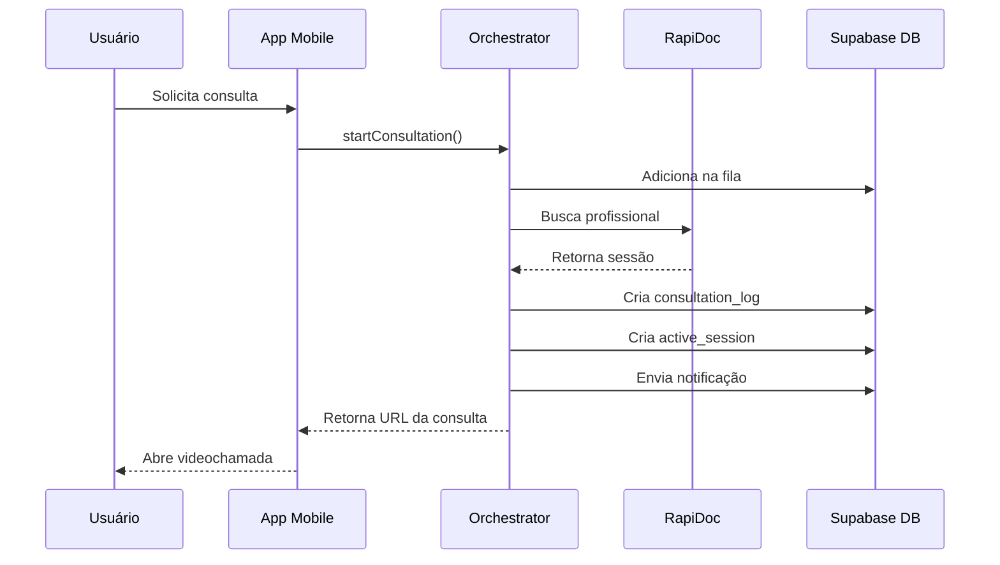

# Edge Functions - AiLun Saude

Este documento descreve as Edge Functions do Supabase implementadas no projeto e como utilizá-las.

## 📋 Visão Geral

O projeto utiliza **3 Edge Functions** principais para orquestrar serviços de saúde:

1. **orchestrator** - Orquestração geral de consultas
2. **rapidoc** - Integração com API RapiDoc para consultas médicas
3. **tema-orchestrator** - Gerenciamento de assinaturas via Asaas

---

## 🔧 1. Orchestrator Function

Função principal para gerenciar consultas médicas, fila de espera e sessões ativas.

### Localização
`supabase/functions/orchestrator/index.ts`

### Ações Disponíveis

#### 1.1 Iniciar Consulta

```typescript
import { startConsultation } from './services/orchestrator';

const result = await startConsultation('doctor', 'Cardiologia');

if (result.success) {
  console.log('Consulta iniciada:', result.data);
  console.log('URL da consulta:', result.data.session.consultationUrl);
}
```

**Parâmetros:**
- `serviceType`: `'doctor' | 'specialist' | 'psychologist' | 'nutritionist'`
- `specialty`: Especialidade médica (opcional)

**Retorno:**
```typescript
{
  success: true,
  data: {
    consultationLog: { ... },
    session: {
      sessionId: string,
      consultationUrl: string,
      estimatedWaitTime: number,
      professionalInfo: {
        name: string,
        specialty: string,
        rating: number
      }
    }
  }
}
```

#### 1.2 Verificar Fila de Espera

```typescript
import { checkQueue } from './services/orchestrator';

const result = await checkQueue();

if (result.success) {
  console.log('Sua posição na fila:', result.data.userQueue);
  console.log('Estatísticas globais:', result.data.globalStats);
}
```

#### 1.3 Obter Sessões Ativas

```typescript
import { getActiveSessions } from './services/orchestrator';

const result = await getActiveSessions();

if (result.success) {
  result.data.forEach(session => {
    console.log('Sessão ativa:', session.session_url);
    console.log('Profissional:', session.professional_info);
  });
}
```

#### 1.4 Cancelar Consulta

```typescript
import { cancelConsultation } from './services/orchestrator';

const result = await cancelConsultation(consultationId);

if (result.success) {
  console.log('Consulta cancelada com sucesso');
}
```

#### 1.5 Obter Notificações

```typescript
import { getNotifications } from './services/orchestrator';

const result = await getNotifications();

if (result.success) {
  result.data.forEach(notification => {
    console.log(notification.title, notification.message);
  });
}
```

### Fluxo de Funcionamento

1. **Usuário solicita consulta** → Entra na fila
2. **Orchestrator chama RapiDoc** → Busca profissional disponível
3. **Cria registro no banco** → `consultation_logs` e `active_sessions`
4. **Envia notificação** → Usuário recebe confirmação
5. **Retorna URL da consulta** → Usuário acessa a videochamada

---

## 🏥 2. RapiDoc Function

Integração com a API externa RapiDoc para conectar pacientes com profissionais de saúde.

### Localização
`supabase/functions/rapidoc/index.ts`

### Tipos de Consulta

#### 2.1 Médico Geral (Doctor)

```typescript
// Chamada interna via orchestrator
{
  action: 'request-consultation',
  serviceType: 'doctor',
  urgency: 'high' // low, medium, high
}
```

**Endpoint RapiDoc:** `/api/v1/consultations/immediate`

#### 2.2 Especialista (Specialist)

```typescript
{
  action: 'request-consultation',
  serviceType: 'specialist',
  specialtyArea: 'Cardiologia'
}
```

**Endpoint RapiDoc:** `/api/v1/consultations/specialist`

#### 2.3 Psicólogo (Psychologist)

```typescript
{
  action: 'request-consultation',
  serviceType: 'psychologist'
}
```

**Endpoint RapiDoc:** `/api/v1/consultations/psychology`

#### 2.4 Nutricionista (Nutritionist)

```typescript
{
  action: 'request-consultation',
  serviceType: 'nutritionist'
}
```

**Endpoint RapiDoc:** `/api/v1/consultations/nutrition`

### Variáveis de Ambiente Necessárias

```env
RAPIDOC_CLIENT_ID=seu_client_id
RAPIDOC_TOKEN=seu_token_de_acesso
RAPIDOC_BASE_URL=https://api.rapidoc.com
```

### Resposta da API

```typescript
{
  success: true,
  sessionId: "session_abc123",
  consultationUrl: "https://meet.rapidoc.com/session_abc123",
  estimatedWaitTime: 3, // minutos
  professionalInfo: {
    name: "Dr. João Silva",
    specialty: "Clínica Geral",
    rating: 4.8
  }
}
```

---

## 💳 3. Tema Orchestrator Function

Gerenciamento de assinaturas e pagamentos via Asaas.

### Localização
`supabase/functions/tema-orchestrator/index.ts`

### Ações Disponíveis

#### 3.1 Criar Assinatura

```typescript
import { createSubscription } from './services/orchestrator';

const result = await createSubscription({
  customerName: 'João Silva',
  customerEmail: 'joao@email.com',
  customerPhone: '11987654321',
  customerDocument: '12345678900', // CPF
});

if (result.success) {
  console.log('Assinatura criada!');
  console.log('ID:', result.data.subscription_id);
  console.log('Valor: R$', result.data.value);
  console.log('URL de pagamento:', result.data.payment_url);
}
```

**Plano:** R$ 89,90/mês (boleto mensal)

#### 3.2 Verificar Assinatura

```typescript
import { checkSubscription } from './services/orchestrator';

const result = await checkSubscription();

if (result.success && result.data.subscribed) {
  console.log('Assinatura ativa!');
  console.log('Próximo vencimento:', result.data.subscription.next_due_date);
} else {
  console.log('Sem assinatura ativa');
}
```

#### 3.3 Cancelar Assinatura

```typescript
import { cancelSubscription } from './services/orchestrator';

const result = await cancelSubscription();

if (result.success) {
  console.log('Assinatura cancelada');
}
```

### Variáveis de Ambiente Necessárias

```env
ASAAS_API_KEY=sua_chave_api_asaas
```

### Integração Asaas

A função se integra com a API do Asaas para:

1. **Criar cliente** no Asaas
2. **Criar assinatura recorrente** (R$ 89,90/mês)
3. **Gerar boleto** de pagamento
4. **Verificar status** da assinatura
5. **Cancelar assinatura** quando solicitado

**API Base:** `https://www.asaas.com/api/v3`

---

## 🔐 Autenticação

Todas as Edge Functions requerem autenticação via token JWT do Supabase.

### Como Funciona

1. Usuário faz login no app
2. Supabase retorna token de autenticação
3. Token é enviado no header `Authorization: Bearer <token>`
4. Edge Function valida o token e identifica o usuário

### Exemplo de Chamada

```typescript
const { data: { session } } = await supabase.auth.getSession();

const { data, error } = await supabase.functions.invoke('orchestrator', {
  body: { action: 'start_consultation', serviceType: 'doctor' },
  headers: {
    Authorization: `Bearer ${session.access_token}`
  }
});
```

**Nota:** O SDK do Supabase adiciona o header automaticamente quando o usuário está logado.

---

## 📊 Fluxo Completo de Consulta



---

## 🛠️ Desenvolvimento Local

### Testar Edge Functions Localmente

```bash
# Instalar Supabase CLI
npm install -g supabase

# Iniciar servidor local
supabase start

# Servir função específica
supabase functions serve orchestrator --env-file .env.local

# Testar com curl
curl -i --location --request POST 'http://localhost:54321/functions/v1/orchestrator' \
  --header 'Authorization: Bearer YOUR_TOKEN' \
  --header 'Content-Type: application/json' \
  --data '{"action":"check_queue"}'
```

### Deploy de Edge Functions

```bash
# Deploy de uma função específica
supabase functions deploy orchestrator

# Deploy de todas as funções
supabase functions deploy
```

---

## 📝 Logs e Monitoramento

### Visualizar Logs

1. Acesse o [Supabase Dashboard](https://app.supabase.com/project/bmtieinegditdeijyslu)
2. Vá em **Edge Functions**
3. Selecione a função
4. Clique em **Logs**

### Logs Importantes

```typescript
// Logs de sucesso
console.log('Orchestrator request:', requestData);
console.log('Consulta iniciada:', logData);

// Logs de erro
console.error('Start consultation error:', error);
console.error('RapiDoc API Error:', { message, timestamp, stack });
```

---

## ⚠️ Tratamento de Erros

### Erros Comuns

#### 1. "Não autorizado"
**Causa:** Token inválido ou expirado  
**Solução:** Fazer login novamente

#### 2. "Configuração da API não encontrada"
**Causa:** Variáveis de ambiente não configuradas  
**Solução:** Configurar `RAPIDOC_*` ou `ASAAS_API_KEY`

#### 3. "Você já tem uma consulta ativa"
**Causa:** Usuário tentou iniciar consulta com outra em andamento  
**Solução:** Finalizar consulta atual primeiro

#### 4. "Erro ao conectar com o serviço médico"
**Causa:** API RapiDoc indisponível  
**Solução:** Tentar novamente em alguns minutos

### Exemplo de Tratamento

```typescript
const result = await startConsultation('doctor');

if (!result.success) {
  switch (result.error) {
    case 'Você já tem uma consulta ativa':
      Alert.alert('Atenção', 'Finalize sua consulta atual antes de iniciar outra');
      break;
    case 'Não autorizado':
      // Redirecionar para login
      navigation.navigate('Login');
      break;
    default:
      Alert.alert('Erro', result.error);
  }
}
```

---

## 🔄 Realtime Updates

### Inscrever-se para Atualizações

```typescript
import { supabase } from './services/supabase';

// Escutar novas notificações
const subscription = supabase
  .channel('notifications')
  .on(
    'postgres_changes',
    {
      event: 'INSERT',
      schema: 'public',
      table: 'system_notifications',
      filter: `user_id=eq.${userId}`,
    },
    (payload) => {
      console.log('Nova notificação:', payload.new);
      // Mostrar notificação no app
    }
  )
  .subscribe();

// Cleanup
subscription.unsubscribe();
```

---

## 📚 Recursos Adicionais

- [Supabase Edge Functions Docs](https://supabase.com/docs/guides/functions)
- [Deno Runtime](https://deno.land/manual)
- [API RapiDoc](https://docs.rapidoc.com)
- [API Asaas](https://docs.asaas.com)

---

## 🆘 Suporte

Para problemas com Edge Functions:

1. Verifique os logs no Dashboard
2. Confirme variáveis de ambiente
3. Teste localmente com Supabase CLI
4. Consulte a documentação das APIs externas

---

**Desenvolvido por AiLun Tecnologia**  
CNPJ: 60.740.536/0001-75  
Email: contato@ailun.com.br

